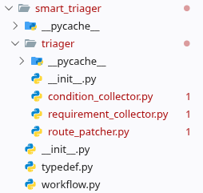

# LLM Designing

written by *n1ghts4kura* on 2026 Feb 22 02:00

> **TIP1**: 目前 功能仍然未进行优化，因此现在去阅读我的源代码并不是最好的体验。当然，可以看。
> **TIP2**: 建议提前阅读python库 *Pydantic* 的官方文档 ([Here](https://pydantic.com.cn/))，或者使用搜索引擎了解一下这个库。
>
> 在 VSCode -> Markdown Preview 插件中阅读 以获得最好的图片展示功能。
> 阅读时 打开 `requirement_collector.py` 与 `route_patcher.py` 两个代码文件 以 获得最好的阅读体验。
>

## Catalogue

| 标题 | 点下面的可以跳转 |
|--- |--- |
| 文件结构 | [click me](#file-strucure) |
| **Agent 代码结构** | [click me](#agent-definition) |
| &emsp;1. 文件功能讲解 & 导入 | [click me](#1-文件功能讲解--导入) |
| &emsp;2. 提示词编写 | [click me](#2-提示词编写) |
| &emsp;&emsp;`## Background` | [click me](#1-background) |
| &emsp;&emsp;`## Role` | [click me](#2-role) |
| &emsp;&emsp;`## Input` | [click me](#3-input) |
| &emsp;&emsp;`## Output` | [click me](#4-output) |
| &emsp;&emsp;`## Criteria` | [click me](#5-criteria) |
| &emsp;&emsp;`## Requirements` | [click me](#6-requirements) |
| &emsp;&emsp;`## Example` | [click me](#7-example) |
| &emsp;3. `logit-bias` 设计 | [click me](#3-logit-bias-设计) |
| &emsp;4. 底层 API 设计 | [click me](#4-底层-api-设计) |
| &emsp;5. 原始输出后处理 | [click me](#5-原始输出后处理) |
| &emsp;6. 导出 | [click me](#6-导出) |
| **Prompt Fine-Tuning** | [click me](#prompt-fine-tuning) |
| **DO NOT BELIEVE YOUR USER** | [click me](#do-not-believe-your-user) |


## File Structure



你可以看到，在 feature `triager` 中摆放着四个主要文件: `condition_collector.py`, `requirement_collector.py` 和 `route_patcher.py` 为 Agent 定义文件；`workflow.py` 为 工作流定义文件。让我们来详细展开一下这两种文件。

## Agent Definition

让我们先拿 `requirement_collector.py` 举例子。我们先来给源码分割层次。

```python
# 1. 文件功能讲解 & 导入
# ...
import json
# ...
from src.smart_triager.typedef import *

# 2. 提示词编写
requirement_collector_instructions = """
...
"""

# 3. **logit-bias** 设置
_logit_bias = utils.build_logit_bias(
    # ...
)

# 4. 底层 API 设计
# (1). 在线 API
async def collect_requirement_online(input: str) -> RequirementCollectorOutput | None:
    ...
    # 5. 原始输出后处理
    return ...

# (2). 离线 API
async def collect_requirement_offline(input: str) -> RequirementCollectorOutput | None:
    ...
    # 5. 原始输出后处理
    return ...

# 6. 导出
__all__ = [
    "collect_requirement_online",
    "collect_requirement_offline"
]
```

---

### 1. 文件功能讲解 & 导入

这个没啥好说的。

文件头的 docstring 个人习惯是 第一行写一个能表达出意思来的文件位置的URL；第二行写一个这个文件要干什么。

导入的话也没啥，导入库 / 导入本地模块 之间隔开一行，然后最后一行导入完与真正的逻辑代码空两行出来。

这么搞美观一点。^

### 2. 提示词编写

在提示词 **变量命名** 时，推荐命名结构为 `<agent_name>_instructions`，比如这个案例中 `requirement_collector_instructions`。

**具体内容**方面，我们首先要对提示词进行分层，将提示词分为 `## Background`, `## Role`, `## Input`, `## Output`, `## Criteria`, `## Requirements` 和 `## Example` 一共七个模块。

#### 1. `## Background`

这一个部分可以写你的 **整体AI功能** 的 **概述**，以及说 **背景信息** 啥的。

在这个案例中，我选择说明了 整个寻路功能 的作用 与 实际目的，等等。

#### 2. `## Role`

这一个部分就写这个 agent 的 **角色设定**，写它在这个 **整体AI功能** 中负责哪一小部分的内容，*概括性地来说* 要干点什么。

在这个案例中，我将这个 agent 设定为了一个 收集用户个性化路径需求 的角色，任务是 提取用户输入文字中 有关路径规划的个性化需求。

#### 3. `## Input`

这一个部分就写 agent 的具体输入的格式会是怎么样的，是 `str` / `dict` / `pydantic.BaseModel` / ... 的类型；这个具体输入可能会是怎么表达出来的，里面有可能包含什么信息，等等。

在这个案例中，我就 **特别说明** 了 用户输入是 **中文** 的，里面夹杂了 它对于整体功能寻路而言 的 个性化需求，比如说 去药房拿药之前要上个厕所，之类的。

如果输入是 **纯粹的字符串** （就像这个案例一样）的话，你可以就这样简单的说一下 简单带过就好了。

如果输入是一个 **对象** 的话就复杂一点。我们可以看到 `route_patcher.py` 部分。

拉到提示词 `## Input` 部分，可以发现我使用 **Markdown** 格式的文字，向模型说明了他的输入会是一个 **JSON对象**，并在下面详细的说明了 每一个键值 代表着的 **非常详细** 的意思。如果值也为一个对象，那就继续说明下去。

可以在说明中 **粗略** 的举几个可能出现的例子 -> `(e.g. Sdfs, urnv, jfkj, etc.)`，详细的举例我们放到后面的部分。

#### 4. `## Output`
这个部分与 `## Input` 部分类似，都是要 **非常详细** 的说明，输出的结构得是怎么样的，每一个键值背后的 **非常详细** 的意思，等等啥的。

#### 5. `## Criteria`
这个部分的作用就是，详细说明你的输入是要经过怎么样的过程才能转化为输出，有点像解数学题时的过程吧。

**必须要指出的是**，在当前一个 *本地小模型* 的背景下，你应该将 criteria 写的**尽可能详细一些**，给 agent 说明白 要是题目给了什么条件 你就应该怎么推 得出怎么样的答案，等等。不能指望 *这个项目中的* agent 真的是非常聪明的 **能自己思考并解决问题**。

> 这个部分 某种程度上其实就是 **Prompt Enginnering** 中 指引模型如何思考的 **CoT** 技术。

在案例 `route_patcher.py` 中，我选择直接写明白：要是用户提到 "给医生看病前" 这样的话，就表明 这个需求要在 去到特定诊室前 被执行完 -> `when` = `xxx_clinic` 的这样 **明确的** 取值。

**注意**：现在我问一个问题：如果用户文字输入中没有你要的任何信息，怎么办？

因此，你还应该说明，"当用户输入中没有预期内容"此类情况下的处理逻辑，是将其标注为 `"this field is not mentioned from the user input."`，还是留空为 `None` / `[]` / `{}` / ...，还是……

#### 6. `## Requirements`

这个部分也比较含糊。

你可以选择在这个部分 **疯狂地** 强调：输出一定要是纯的JSON对象，不要给我乱加上下文作为输出；不要输出 ` ```json ` 的这种 tag。

你还可以在这个部分 强调 **输出质量**：一定要符合用户需求；一定要结合用户输入的实际情况做出判断；一定要符合常理；等等。

#### 7. `## Example`

这个部分就按照这个格式 举例子 就好了。举例数量大约 5 到 6 个可能就差不多了，当然你往上添肯定可以。你甚至可以选择 在展示的时候 自己直接说这里面的例子作为输入，这样 **大概率** 也会把例子的输出 复述出来。（当然我说的是 *大概率*，意味着要是因为某些不可描述的原因，在某些时候没有复述成功，但多测两次又可以，那也正常，认了吧，多优化一下提示词。）

> 这个部分 某种程度上其实就是 **Few-shot** 技术。因为我们的本地模型太小了，所以 **Few-shot** 中只是举两三个例子的示例不太适合我们，**Zero-shot** 这种不举例子的对我们而言可能效果更差了。我们要变成 **Many-shot**。 LOL.

> 提示词这一部分其实没写太好，你可以看完之后自己再看点别的教程啥的。

### 3. `logit-bias` 设计

我们可以看到 `route_patcher.py` 中的 233 行。

这里声明了一个 `_logit_bias` 变量，并且调用了一个 `build_logit_bias` 的函数。

这个函数实际上是针对于 **本地小模型** 进行设计的，实际功能就是 **调整** 某些 token 的输出概率。

- `get_model_func`: 函数`build_logit_bias`通过获取 **指定的大模型** 里面的 Token Encoder，将某些字符转换为 一个个 token 向量。

- `string_to_probability`: 这个参数填入你想要调整输出概率的 **内容** 以及对应的 **调整程度**。
比如说我想压低 "What the hell" 这*整句话* 的输出概率，那你就可以在这个参数字典中写 `{"What the hell", -3.0}`，函数`build_logit_bias`内部会把这句话对应的三个（应该是）token的概率通通压低。

**注意**: `-3.0` 并不是 确切的 概率数值，可能只是一种相对关系。一般来说，`-1.5`左右的取值就会在一定程度上取得明显成效。如果你想压低到`-5.0`这种取值，理论上其实也行，但是可能会**附加的牵连到**别的字。

（因为每个字之间都是有语义联系的嘛，你要是压低了"hello"的概率，某种程度上，模型也会减少输出"world"这个词的概率，尽管**这个现象**并不能**明显体现**出来，比较的玄学。你看完会发现我只针对一些 符号/弱语义 内容把对应的调整量压得比较低，别的都不太敢压。）

-  `token_eos`: 这个参数代表着模型输出 结束符 的对应的概率调整量。
实测：要是不调整这个参数，模型大概率会在输出JSON对象到一半，然后输出就断了，意思就是话说一半就4了。因此，把这个参数调整到 `-5.0` 是比较好的选择。如果太高了（`-10.0`）的话，有可能这个模型的输出就没完没了了，胡扯扯到 max_tokens 的数量上限也不意外，毕竟你都不让别人停下来说话嘛相当于是。

- `json_block`: 这个参数代表着模型输出 ` ```json ` 和 ` ``` ` 这两玩意的对应的概率调整量。
实测：就算压到了 `-5.0` 的数值，很多时候还是会额外输出这两个符号。继续往下压的话，我感觉可能会影响最终输出了？所以没继续压低了，放到后面的章节说明。

这个玩意具体咋用呢？：

1. 把 `token_eos` 参数 压到 `-5.0` (暂时的推荐值)
以*减少* 模型输出内容意外截断 问题

2. 把 `json_block` 参数 压到 `-5.0` (及更低，未测试)
以*减少* 模型意外输出内容 问题

3. 自定义 `string_to_probability` 参数
以*提高* 你需要的**关键字** 的输出概率
比如：我的最终输出中的 JSON 对象里边 有一个 key 是 `count`，还有一个 key 是 `summary`，那么为了不让（少让）模型 **漏输出** 这两个 key to value，我们手动提高他的输出概率:

```python
_logit_bias = build_logit_bias(
    get_model_func = <some_model_getter>,
    string_to_probability = {
        "count": 1.2,
        "summary": 1.2
    },
    token_eos = -5.0,
    json_block = -5.0
)
```
> Suggestion: 有种执念就是不要手动拔高 最终输出中 **会变化的内容** 的输出概率。
> - 比如 让模型 在一群地点(`loc_a`, `loc_b`, ...)中 **抽取** 当前最有可能在的地点
> 那么我觉得 "把所有地点(`loc_a`, `loc_b`, ...)的输出概率都拉高" 这样的行为没毛病。
> - 但是 又比如 让模型自己 在没有上述预设条件的情况下 生成内容
> 那么我觉得 这个时候再给某些指定的值 拉高输出概率 不太好。
> 没啥原因，就是觉得不太好，可能是觉得跟写死输出没区别。
>
> 当然 你要是确实是有这种需求 咱也拦不住，用也可以。反正只是 suggestion.
>

### 4. 底层 API 设计

这个部分就比较公式化了。

定义一个 `async def` 的函数，然后传入参数自己写，输出类型注解也最好表清楚要返回啥类型的东西，**方便VSCode在静态编码环节DEBUG**。不然到时候测试的时候报错是传参类型这种问题，然后找了半天BUG才搞定，真的是得不偿失，毕竟写个 `async def a() -> str | None` 也不是难事情。

对于 **调用在线模型** 的函数体内部，我选择先声明 agent 变量。

这里也有一点玄学的小讲究。
`name`参数写的正经一点、完整一点。
具体的模型参数配置就看你自己了，`temperature`这个参数调整起来也没啥好方法，毕竟我们不是 OpenAI，没有人家那种配套的微调工具。
`max_tokens`的话看着来，一般来说 4096 的取值够用了。

> **重要提醒**：`agents.ModelSettings.max_tokens`这玩意表示**最大输出 token 数**，只计算输出部分，不包含输入（输入 token 由 prompt 本身决定）。输入 + 输出的**总上限**是 `llama-cpp-python` 中 `Llama()` 的 `n_ctx` 参数。所以在线模型把 `max_tokens` 设到 4096 没问题；但离线模型要确保 `system prompt token数 + user input token数 + max_tokens` 不超过 `n_ctx`，否则会 segfault。

声明完 agent 之后，就调用 `Runner.run` 用 **await** 关键字 异步等待原始输出结果。

对于 **调用离线模型** 的函数体内部，我选择获取离线模型之后，将`model.create_chat_completion`函数 **用匿名函数** 再包装一层。目的是调用 `asyncio.to_thread` 将一个原本 **阻塞主线程** 的函数改运行到 另一个线程上，然后利用 `asyncio` 的 **协程** API 异步调用。这样做能够实现，在**不调用同一个 Llama 模型实例的情况下**，我可以同时运行多个像这样的底层API，**节约时间**。
> **重要**：`llama-cpp-python` 不支持 同一个`Llama`实例 在同一时间 的同时多次调用（非线程安全）。因此，CC 离线版与 RC 离线版**共享同一个** `get_offline_chat_model()` 实例，**不能**用 `asyncio.gather()` 并发执行，必须串行 `await`。只有两个调用分别使用**不同的模型实例**（如一个用 chat model、另一个用 reasoning model）时，才可以并发。

这里也同理，**await** 完之后就得到了原始输出结果，类型为 `str`。

下一步我们将要对原始输出结果的字符串进行处理，使其变成一个结构化的 **Pydantic** 对象，方便 VSCode 在静态时期就能够检查出类型问题。要是使用 `dict` 的话，还是太**动态语言**了，不够稳定。

### 5. 原始输出后处理

得到输出之后，我们可能会遇到 **包括但不限于** 如下的几种 **意外**:

- 输出内容意外截断，比如 `{"key": "va`。

- 在提示词中约束了 LLM 让他只生成一个纯净的 **JSON对象**；但是实际上 LLM 还是在 `{...}` 上下文生成了其他内容，比如 ` ```json / ``` `。

- 生成的内容结构不符合要求，比如让 LLM 只生成1个键值对，但是最后返回了 0个 / 超过1个键值对。

- ...

当遇到原始输出的问题时，我们有 **普遍性解法** 与 **特异性解法**。

**普遍性解法**:

1. *重新跑一次*，让他*再输出一回*，说不定行了呢

2. *手动检测* 出 `{...}` 这个区块的内容，将前后文删除掉，确保没有别的文字 / Markdown 标签  

3. ... 暂时没想到了。

**特异性解法**:

1. 用 `logit-bias` 调整 特定内容的输出概率，如 特定的 key

2. **优化**提示词（后面章节详细说）

3. ...

在我目前的案例中，我选择了 **两种解法混用**:

- 在定义 agent 的具体文件 (`<feature>.py`) 中 使用 `logit-bias` & 优化提示词 策略

- 在 `workflow.py` 最终导出 *高层API* 的函数中 使用 重跑Retry 策略:
具体地说，就是加入 重跑逻辑，并加入上限限制重跑次数，**自我约定** 若重跑后仍然失败 直接返回 None ; 
在具体的路由函数中，检查 *高层API* 返回值是否为 None，若是则返回 500 + JSONResponse `{"success": false, ...}`

在大部分的情境下，问题都能通过上述两个解法 以 **不消耗额外资源** 的方式 **改善/消除**。

如果用了上面两种解法还是有一定概率出现问题，那么你最好 **降低单一agent任务的复杂度**。

在我的案例 `condition_collector.py`(仍未按下面所说重构) 中，实际上这个 agent 的最终（唯一关键的）输出字段是 `clinic_selection`。
但是考虑到 **本地小模型** 的能力，实际上我们应该将其拆分为 Condition Collector + Clinic Selector 的组合，前者将患者的文字描述转化为 **结构化的** 信息，后者将 **结构化的** 信息 转化为 最终的选择结果 clinic_id。

将 一个小任务 再度拆分为 两个环节 能够获得 **更高质量的输出** 与 **更慢的推理速度**。自行权衡。

---


### 6. 导出

没啥好说的。

## Prompt Fine-Tuning

让我们先 **看完** 这个 非常难用的  [Prompt Engineering Guide](https://www.promptingguide.ai/zh) 中的 **提示技术** 部分。至于这个网站后面的区域，自己去探索吧！。 我没看完。，

在实际编码提示词中，我们有几个需要注意 / 优化的点:

1. 多用英文提示词；只在描述**关键/复杂/混乱逻辑**的时候 使用中文，并且要 **写完整**，也就是说这一个小部分内全部用中文写，其余地方还是用英文。

> 毕竟训练语料和之前一开始的权重还是以英文内容为基础的，所以从某种程度上来说输出效果会更好。反正没啥成本。
> 你要愿意自己写那就是锻炼英语水平；你要不愿意自己写就写中文版给AI翻译，然后自己丢翻译器里，再过目一回。
>

2. 检查你的英文提示词中是否有语法错误。

> 这个是最基础的问题。虽然说有语法错误他应该也能理解，但是还是不出错最好嘛。

3. 多给表达肯定的指引，少给表达"不要"的指引。不要说 "不要说xxx"，要说 "要说xxx"。

4. (测试中) 尝试加强模型对无关信息的过滤：从语气词（如果你想从语气中推测出啥另提），到 *与你需要的信息* 无关的内容。

> 拿我的案例举例子。提这个东西的原因是因为，如果这个地方成效显著，那么我就可以在前端写明白，可以让用户一次性把要说的话全说完，然后**同时**输入给所有的 第一层 llm，让他们**同时异步推理**，提高处理速度。
> 不知道你能不能看懂，补充一句：可能只限于我案例中的这种情况？自己看着来吧。
>

5. ...

## DO NOT BELIEVE YOUR USER

（如果你觉得使用用户不必做那么全面（暂时），那么暂时可以跳过这一部分）

上述的大部分讨论中，我们似乎极大的忽略了用户的输入质量，而完全的在讨论输出质量。因此现在我们来思考一下用户层面的问题成因。

前面粗略地提了一下，如果用户输入中就不包含我需要的信息，那么我们可以在 `criteria` 部分写明白让 llm 返回空值。这是一种处理方式。

那么在得到空值之后，我们要怎么设计逻辑？或者说，我们要干什么？

还是拿我的案例举例（我自己还没改。）

1. 如果用户 **所有** 信息要素都输入完整，那么我就可以像上面所说一样，利用我调出来的 *对无用信息的过滤能力*，将输入一次性给完，然后 **只通过** 一个API （ `/get_route_patch` ) 直接一次性得到结果输出。

2. 如果用户输入少了———那我废了。

因此在这个 `llm -> router` 的区域，我们应该将单一功能 API 拆分成 多个接口，由 **返回到前端** 的输入 的状态 （是否有值为空？）来决定，是继续向用户提问该信息，还是继续处理下一个信息。

> 你可能疑惑：这个功能实际上放在同一个接口也能实现啊。比如说靠 `status` 取值分类为 `full / unfull`，后面再加入 `leak` 描述具体缺少内容不是也可以吗？就像：
> ```json
> {
>     "status": "unfull",
>     "leak": [
>         {
>             "name": "description", // 对于不适的描述
>             "reason": "empty" // `empty` - 无描述 ; `unclear` - 不够明确 ; ...
>         }
>     ]
> }
>
> ```
> 没事的你可以这么写，到时候维护难度上来了 求 Claude(Copilot) 了也修不了Bug。T_T
> 这种写法大大的增加了单一接口的复杂度，虽然看着这个解决方案好像挺美观的（其实我觉得这个JSON object 结构有一种复杂的美感。-_），但是最要命的是增加使用复杂度，你要在代码中➕ 1e+9 个 if语句。
>

## ...

不知道写啥了捏。

